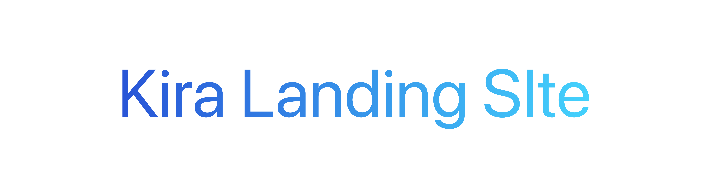

<picture>
  <source media="(prefers-color-scheme: dark)" srcset="Images/KiraLandingSiteBannerDark.png">
  <source media="(prefers-color-scheme: light)" srcset="Images/KiraLandingSiteBannerLight.png">
  
</picture>

# Kira Landing Site

Official landing site and documentation hub for Kira, a powerful, flexible, multiplatform programming language built for speed, expressiveness, and safety.

## What Is Here

- A polished homepage for the Kira language
- Install instructions for macOS, Linux, and Windows
- Short documentation pages for syntax, examples, and packages
- Theme-aware GitHub banner assets for light and dark mode
- SEO metadata, sitemap, robots config, and social preview setup

## Pages

- `/` - language overview, feature sections, and install call-to-action
- `/install` - platform-specific install guide and troubleshooting notes
- `/docs` - documentation index and suggested reading path
- `/docs/syntax` - core Kira syntax guide
- `/docs/examples` - example-oriented learning page
- `/docs/packages` - package workflow and dependency guide

## Tech Stack

- Next.js 16
- React 19
- TypeScript
- Tailwind CSS 4
- Bun lockfile for dependency reproducibility

## Development

Install dependencies:

```bash
bun install
```

Run the development server:

```bash
bun run dev
```

Open [http://localhost:3000](http://localhost:3000) to view the site.

## Scripts

```bash
bun run dev       # Start the local development server
bun run build     # Build the production site
bun run start     # Start the production server
bun run lint      # Run ESLint
```

## Project Structure

```text
src/app/             App routes, metadata, sitemap, and robots config
src/components/      Layout, section, and UI components
src/data/            Shared navigation, docs, install, and page content
public/              Public icons and image assets
Images/              GitHub README banner images
```

## Repository Description

Official landing site for Kira, a powerful, flexible, multiplatform programming language built for speed, expressiveness, and safety.
